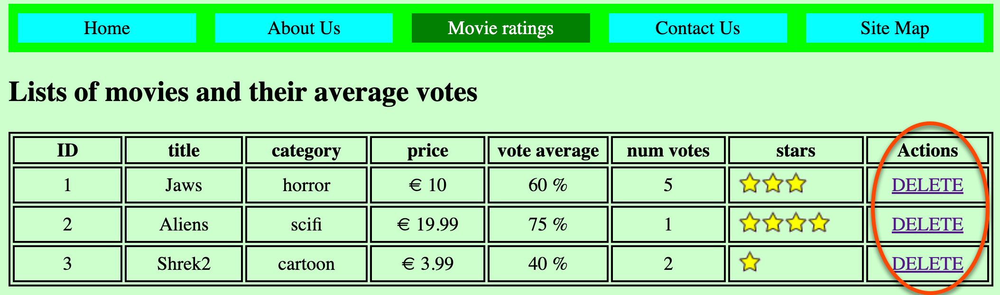

# evote-movie-2022-08-crud-delete

part of the evote-2022 project sequence

- [https://github.com/dr-matt-smith/evote-movie-2022](https://github.com/dr-matt-smith/evote-movie-2022)


## NOTES for this project step

CRUD - adding a delete link on the Movie list page



- add to `/templates/list.php` an extra table column heading `Actions`

  ```php
        <h2>Lists of movies and their average votes</h2>

        <table>
            <tr>
                <th> ID </th>
                <th> title </th>
                <th> category </th>
                <th> price </th>
                <th> vote average </th>
                <th> num votes </th>
                <th> stars </th>
                <th> Actions </th>
            </tr>
  ```

- add to `/templates/list.php` an extra table column data cell being the word `DELETE` whose link URL is `href="/?action=delete&id=<movieIdHere>`

    ```php
        <td><?= $movie->getId() ?></td>
        <td><?= $movie->getTitle() ?></td>
        <td><?= $movie->getCategory() ?></td>
        <td>&euro; <?= $movie->getPrice() ?></td>
        <td><?= $movie->getVoteAverage() ?> %</td>
        <td><?= $movie->getNumVotes() ?></td>
        <td>
            <?php if($movie->getNumVotes() > 0): ?>
            getStarImage() ?>" alt="star image for percentage">
            <?php else: ?>
            (no votes yet)
            <?php endif; ?>
        </td>
        <td>
            <a href="/?action=delete&id=<?= $movie->getId() ?>">
                DELETE
            </a>
        </td>
    ```

- add a new case to the front controller login in `/src/Application.php`. When the URL action is `delete`, a value for `id` should be extracted from the URL, and passed to `MainController` method `delete(...)`

  ```php
        class Application
        {
            public function run()
            {
                $action = filter_input(INPUT_GET, 'action');
                $mainController = new MainController();

                switch ($action){
                    case 'delete':
                        $id = filter_input(INPUT_GET, 'id');
                        $mainController->delete($id);
                        break;

                    ...
  ```

- add to`/src/MainController.php` new method `delete(...)`, which uses the argument received to invoke the delete method of a `MovieRepository` object. We then redirect the controller to invoke the list method.

  ```php
        class MainController
        {
            public function index()
            {
                require_once __DIR__ . '/../templates/index.php';
            }

            ...

            public function delete(int $id)
            {
                $movieRepository = new MovieRepository();
                $movieRepository->delete($id);

                $this->list();
            }
        }
  ```
